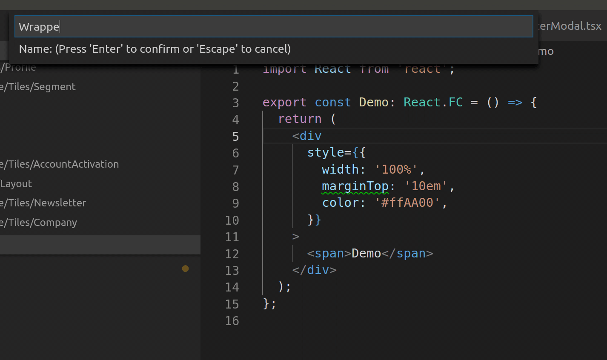

# StyCo README

Transform JSX-Tags with style-props to styled components. 

VSCode Marketplace: [Link](https://marketplace.visualstudio.com/items?itemName=DanielHuth.styco)

## Demo

## Usage

Either use the command `StyCo` with `CTRL` + `SHIFT` +  `P` or the code action with `CTRL` + `.` while in the line of the style-attribute.

## Configuration

There are several options that can be found in the options.

- `insertImportStatement`: Insert import statement of the detected library if not existent. (default: `true`)
- `orderStyleByName`: Order styles by name alphabetically. (default: `false`)
- `saveAfterExecute`: Save the file after command execution. (default: `true`)
- `disableCodeAction`: Don't show a CodeAction if a `style`-Attribute is found. (default: `false`)
